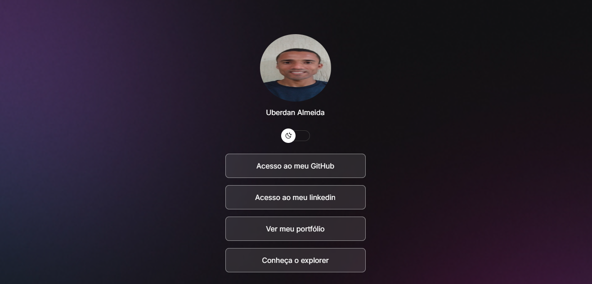

# Projeto de Perfil Social

Este projeto é uma página de perfil social simples, desenvolvida usando HTML, CSS e JavaScript. Ele apresenta informações básicas do usuário, links para suas redes sociais e um switch de tema claro/escuro.

## Estrutura do Projeto

O projeto é composto pelos seguintes arquivos:

* `index.html`: Estrutura HTML da página.
* `style.css`: Estilos CSS para a página.
* `script.js`: Lógica JavaScript para interatividade.
* `imagens/`: Diretório contendo as imagens de perfil (`foto uber.jpg` e `foto perfil.jpg`).

## Funcionalidades

* Exibição de foto de perfil e nome do usuário.
* Links para perfis do GitHub, LinkedIn e portfólio.
* Links para o Explorer da Rocketseat.
* Ícones de redes sociais (GitHub e LinkedIn).
* Switch de tema claro/escuro com mudança de imagem de perfil.
* Rodapé com informações de copyright.

## Tecnologias Utilizadas

* HTML5
* CSS3
* JavaScript
* Icones de Ion Icons
* Fontes do Google Fonts